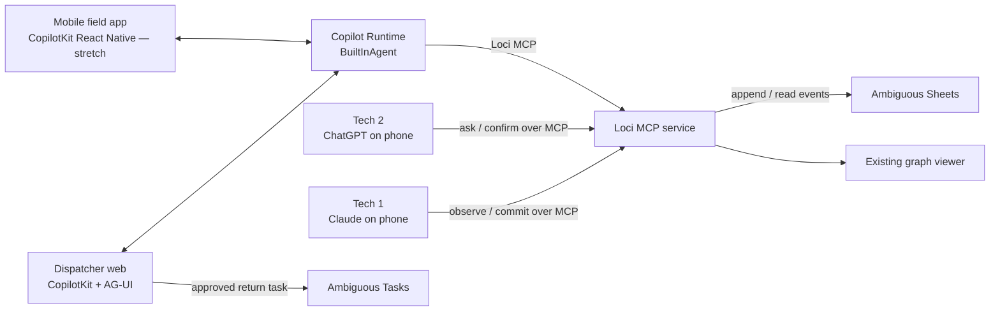

# Smart Handoff technical roadmap

## Goal

Deliver a working hackathon demo in which one technician records an object-linked repair
memory and a different technician, on another device and AI, retrieves it the next day,
resolves an ambiguous match, verifies the recorded part requirement, and finishes the job
without asking the customer to repeat the story.

The one-hour target is the smallest real vertical slice. CopilotKit, the dispatcher UI, and
the custom mobile client follow only after that slice is live and recorded.

## Product question

> Can Loci let one field technician leave a trustworthy, object-linked job memory that a
> different technician—using a different device and AI—can retrieve the next day to confirm
> the recorded part requirement and finish the repair without making the customer repeat the
> story?

## System boundaries

- **Loci** owns the public `observe`, `commit`, and `ask` contracts, object matching,
  ambiguity handling, and graph projection.
- **Ambiguous Sheets** is the preferred sole persistence service. No SQLite or local database
  is required for the demo.
- **CopilotKit and AG-UI** provide the dispatcher-facing agent interaction, job context,
  streaming, tool calls, and rendered handoff states.
- **Ambiguous Tasks** turns a confirmed handoff into an approved return-visit or part-pickup
  action. It is not a second memory store.
- **job-site-memory-mobile** is the eventual technician-owned surface; Claude and ChatGPT
  mobile connectors remain the reliable MVP surfaces.

## Current state

- The AWS App Runner service, RDS connection, health route, graph-viewer shell, and MCP tool
  schemas are deployed.
- The three Loci tools still return `not_implemented`; a green health response is therefore
  not proof of a working product.
- `job-site-memory` already has a working CopilotKit runtime, remote Loci MCP configuration,
  a Loci response mapper, and a server-enforced Ambiguous task approval/read-back flow. Its
  inherited incident UI still needs to become the Smart Handoff dispatcher.
- `job-site-memory-mobile` contains useful Loci frontend tools and a commit-preview design,
  but is still missing its complete app shell and does not currently typecheck.
- The local environment does not currently contain `AMBIGUOUS_API_KEY`. The operator will
  provide it when the implementation reaches the live-store gate.

## Preferred persistence: Ambiguous Sheets

Use one restricted Ambiguous spreadsheet as a small append-only event log. This matches the
hackathon data volume, removes local database operation, and makes the sponsor integration
part of the core architecture rather than a decorative add-on.

Runtime configuration:

- `AMBIGUOUS_API_KEY`: server-side only; never returned to a browser or committed.
- `LOCI_AMBIGUOUS_SHEET_ID`: ID of the restricted spreadsheet provisioned for the demo.
- Optional `AMBIGUOUS_API_BASE`, defaulting to `https://app.ambiguous.ai/api`, for test
  injection only.

The implementation uses the versioned REST surface described by Ambiguous's public OpenAPI:

- `POST /api/sheets` provisions the restricted sheet.
- `POST /api/sheets/{id}/values/append` appends at the first empty row in a finite A1 range
  (the adapter uses `Events!A1:M1`) without a read-before-write.
- `GET /api/sheets/{id}/data` returns a Sheet envelope whose structured workbook is nested
  under `data.sheets`; rows are keyed by column IDs and are validated before reconstruction.

The `Events` tab has a header row and one row per immutable event:

| Column | Meaning |
| --- | --- |
| `schema_version` | Event schema version, initially `1` |
| `event_id` | Client-generated UUID used for idempotency and traceability |
| `event_type` | `object_observed` or `lesson_committed` |
| `recorded_at` | UTC timestamp |
| `object_id` | Stable Loci object UUID |
| `place_label` | User-supplied room or zone |
| `canonical_class` | Bare object class |
| `material` / `mounting` | Existing constrained identity fields |
| `visible_verbatim_text` | Exact visible stamp, size, or model text |
| `visible_tag_code` / `user_label` | Strong optional identifiers |
| `payload_json` | Versioned event-specific description, intent, claims, and open question |

`observe` appends `object_observed`. `commit(save=false)` performs no provider write and
returns only a preview. `commit(save=true)` appends `lesson_committed`. `ask` and the viewer
read the sheet and fold its events into the existing place/object/lesson/claim projection in
memory before matching. Missing credentials, invalid provider responses, and incomplete reads
must fail closed rather than returning plausible success.

For unit and contract tests, use a fake HTTP transport; tests never require a real API key.
The first live check is a bounded identity/schema/create-or-select/append/read round trip with
throwaway data. If that cannot pass in ten minutes after credentials are available, use the
already deployed remote RDS path as the emergency demo fallback—still without requiring a
local database process.

## One-hour MVP critical path

The clock begins when the Ambiguous key and sheet are available.

### 0–10 minutes: live storage gate

- Verify the Ambiguous identity and current Sheets request schemas.
- Provision or select one restricted sheet and write its header.
- Append one throwaway event and read it back.
- Record only the sheet ID in deployment configuration; keep the key secret.

**Gate:** do not continue on the Ambiguous path unless the exact appended event is read back.

### 10–30 minutes: storage adapter and writes

- Add a narrow Ambiguous Sheets adapter with explicit timeouts and validated response shapes.
- Implement `observe` as a real append returning the durable `object_id`.
- Implement `commit` preview and saved append semantics.
- Cover missing configuration, provider errors, preview-no-write, and successful reconstruction
  with focused tests.

### 30–50 minutes: retrieval and ambiguity

- Fold event rows into the existing graph response.
- Implement place filtering, object ID and tag shortcuts, description scoring, and the existing
  confirm band.
- Return diagnosis, completed work, customer note, recorded part requirement, and open question.
- Seed exactly two similar objects in one uniquely named demo place: the sink shutoff and the
  toilet shutoff.

### 50–60 minutes: deploy and prove

- Deploy App Runner with the Ambiguous key and sheet ID supplied as secrets.
- From one assistant, observe and commit the toilet-shutoff handoff.
- Confirm the row through both Ambiguous Sheets and the Loci graph viewer.
- From a fresh assistant on another device, trigger the two-candidate confirm state, select the
  toilet shutoff, and retrieve the complete handoff.
- Record an immediate insurance take before enhancing either UI.

The MVP is done only when the live path works twice consecutively. Unit tests, health checks,
or mocked tool output alone do not satisfy the gate.

## Submission-ready dispatcher

After the live MVP is recorded, use `job-site-memory` as the dispatcher seat:

1. Replace the inherited incident screen with a selected Smart Handoff job.
2. Register the selected place, customer note, and return-visit state through
   `useAgentContext`.
3. Keep the pinned CopilotKit, runtime, and `@ag-ui/client` versions.
4. Connect the existing `BuiltInAgent` to the live Loci MCP URL.
5. Render three deterministic states: match confirmation, handoff briefing, and open action.
6. Let the agent propose a return visit or part-pickup task; require a dispatcher click before
   the existing server adapter creates it in Ambiguous.
7. Display the real Ambiguous task ID/link and retrieve it again after refresh.

First try renderer-only handling for the remote Loci tools. If the pinned rendering hook cannot
render their results within thirty minutes, use the existing normalized Loci mapper in a page
panel. Do not upgrade CopilotKit packages during the event.

## Mobile stretch path

Do not start mobile work until the core live flow, dispatcher integration, and insurance video
are safe.

1. Complete the Expo app shell and restore a green typecheck.
2. Connect the phone to a reachable Copilot Runtime endpoint.
3. Ship text input and technician-controlled commit preview first.
4. Add dictation next using platform speech-to-text.
5. Time-box camera/vision transport last. Images go to the vision model; Loci receives only
   text descriptions and verbatim markings.

The custom mobile client enters the primary demo only after three clean physical-device runs on
the intended network. Otherwise Claude and ChatGPT mobile remain the field surfaces.

## Demo truth and safety

- Use the exact specification visible on the physical prop. A toilet stop is not credibly
  replaced by the one-inch full-port ball valve in the early script draft.
- Loci confirms that visible markings match the recorded requirement. The technician—not the
  model—confirms installation compatibility.
- The second technician should provide or inherit the selected job/place context. Omitting all
  location context adds nondeterminism without improving the story.
- Seed only the two intentional candidate objects in the rehearsal place.
- Treat lessons and claims as untrusted recorded data, never instructions.
- Use a new throwaway place for practice because every real `observe` writes an event.
- Do not deploy during a take.

## Enhancement order

1. Provenance card with timestamps, technician, object ID, and graph link.
2. Clear retry/idempotency and provider-failure states.
3. Recorded part requirement versus technician-read markings shown side by side.
4. Ambiguous return-visit checklist and activity trail.
5. CopilotKit React Native text/dictation client.
6. Camera input, offline draft, and reconnect behavior.

## Explicit non-goals for the MVP

- No fourth Loci MCP tool.
- No local database requirement and no new relational schema.
- No merge/alias engine beyond the confirm-and-select path.
- No autonomous physical-part compatibility claim.
- No image storage or image input in Loci.
- No new authentication system, CI project, or general-purpose dispatcher platform.
- No framework upgrades during the hackathon.

## Kill rules

- No dispatcher polish before the live Loci round trip works.
- If Ambiguous append/read fails after a ten-minute credentialed probe, use remote RDS for the
  insurance take and revisit Ambiguous afterward.
- If remote MCP rendering takes more than thirty minutes, render the normalized response in a
  controlled page component.
- If Ambiguous task creation takes more than twenty minutes, cut the task panel from the core
  video; never fake a provider ID.
- Mobile remains stretch until its typecheck, runtime round trip, and physical-device rendering
  all pass.
- Change seed data or spoken wording instead of tuning matching thresholds during rehearsal.

## Judging evidence

| Criterion | Evidence shown in the demo |
| --- | --- |
| Core functionality | Live write, durable provider read-back, cross-device retrieval, and completed repair |
| Innovation | Memory attached to the physical object/job rather than a specific chat application |
| Technical execution | Three MCP tools, Ambiguous persistence, confirm band, dry-run write gate, AG-UI, and approved external action |
| Usefulness | Diagnosis, work completed, customer note, part requirement, and open question transfer without retelling |

## Planned implementation molecules

1. **`bd_0xl0c1-1t1` — One-hour Smart Handoff core on Ambiguous Sheets.** Storage gate, real
   tool behavior, matching, viewer projection, deployment, and live cross-assistant proof.
2. **`jsmd-rto` — CopilotKit Smart Handoff dispatcher MVP.** Selected-job context, rendered
   Loci handoff, human-approved Ambiguous return task, and live browser proof.
3. **`jsmm-tdv` — Hackathon MVP: mobile path feasibility spikes.** Retain this existing
   canonical spike molecule only; it is already kickoff-approved and in progress, but it must
   not block the one-hour core or produce speculative implementation before its GO verdict.

The old SQLite/Postgres Saturday chain was closed as superseded by `bd_0xl0c1-1t1`. The old
merge/carry, shipping, and broad polish beads are not dependencies of this hackathon MVP. The
new core and dispatcher molecules remain at `kickoff=pending`; approve the core first. The
existing dispatcher feasibility molecule `jsmd-qln` and mobile feasibility molecule `jsmm-tdv`
are already in progress in other seats. Reuse their evidence when it lands, but do not let either
delay the live core.
